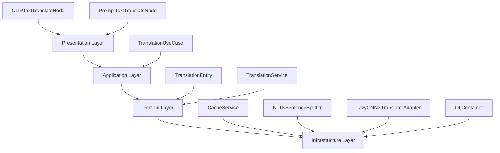

# ComfyUI-translate-offline

## Descripción

ComfyUI-translate-offline es un custom node para ComfyUI diseñado para realizar traducciones de texto de manera offline, utilizando modelos de traducción basados en ONNX (Optimized Neural Network Exchange) de Hugging Face. El proyecto permite integrar traducciones multiidioma en flujos de trabajo de ComfyUI, enfocándose en prompts de texto y conditioning para modelos CLIP. Soporta traducción directa entre pares de idiomas configurados y traducción pivot vía inglés cuando no existe un modelo directo. Utiliza carga perezosa de modelos para optimizar el rendimiento y un sistema de caché basado en SQLite para evitar traducciones repetidas.

## Características

- **Traducción Offline**: No requiere conexión a internet después de la descarga inicial de modelos.
- **Soporte Multiidioma**: Idiomas iniciales: español (es), inglés (en), francés (fr), alemán (de). Expansible agregando nuevos modelos.
- **Traducción Pivot**: Si no hay modelo directo entre dos idiomas, traduce primero al inglés y luego al idioma destino.
- **Carga Perezosa de Modelos**: Los modelos se cargan solo en la primera traducción para cada par de idiomas, optimizando el uso de memoria.
- **Caché Persistente**: Utiliza una base de datos SQLite para almacenar traducciones previas y evitar recalculos innecesarios.
- **Chunking Inteligente**: Divide textos largos en chunks basados en límites de tokens para manejar modelos con restricciones.
- **Integración con CLIP**: Nodo específico para traducir texto y generar conditioning directamente para modelos CLIP.
- **Fallback Seguro**: En caso de error en la traducción, utiliza el texto original como respaldo.

## Arquitectura

El proyecto sigue los principios de Clean Architecture, separando responsabilidades en capas claramente definidas para mantener el código modular, testable y escalable:

### Diagrama de Arquitectura

- **Presentation Layer** (Capa de Presentación): Ubicada en `presentation/nodes/`. Define los nodos principales para ComfyUI: `CLIPTextTranslateNode` (traduce y codifica texto para conditioning) y `PromptTextTranslateNode` (traduce texto de prompt). Ambos usan el `translation_usecase` y manejan errores con fallback.
- **Application Layer** (Capa de Aplicación): Ubicada en `application/`. Contiene `TranslationUseCase`, que orquesta la lógica de traducción, verifica caché, maneja traducción directa o pivot, y coordina el chunking.
- **Domain Layer** (Capa de Dominio): Ubicada en `domain/`. Incluye `TranslationEntity` (dataclasses para requests y results) y `TranslationService` (maneja splitting, chunking, postprocesamiento y fallbacks).
- **Infrastructure Layer** (Capa de Infraestructura): Ubicada en `infrastructure/`. Implementa `CacheService` (SQLite), `NLTKSentenceSplitter` (con NLTK), `LazyONNXTranslatorAdapter` (para modelos ONNX), y `di_container.py` (contenedor de dependencias con mapa de modelos).

## Instalación

1. Clona o descarga el proyecto en el directorio `custom_nodes` de ComfyUI (ejemplo: `ComfyUI/custom_nodes/ComfyUI-translate-offline`).
2. Instala las dependencias ejecutando: `pip install torch optimum[onnxruntime] transformers nltk`.
3. Reinicia ComfyUI. El archivo `__init__.py` registra automáticamente los nodos al importar el módulo.
4. Los modelos se descargan automáticamente la primera vez que se utilizan (requiere conexión a internet inicial para la descarga).

## Configuración

- **Agregar Nuevos Modelos**: Edita el archivo `infrastructure/di_container.py`. En el diccionario `MODELS`, añade pares de idiomas y nombres de modelos de Hugging Face (ejemplo: `("pt", "en"): "Helsinki-NLP/opus-mt-pt-en"`). Los adaptadores se crean automáticamente.
- **Tamaño de Chunks**: En `TranslationService`, el `chunk_size` predeterminado es 400 tokens. Puede ajustarse si es necesario para modelos específicos.
- **Caché**: La base de datos `test_cache.db` se crea automáticamente en el directorio raíz. Para limpiar el caché, elimina el archivo manualmente.
- **Idiomas Soportados**: Inicialmente soporta es, en, fr, de. Es expansible agregando modelos y actualizando el splitter si es necesario.

## Uso en ComfyUI

- **Nodo CLIPTextTranslateNode**:
  - Conecta un modelo CLIP, ingresa el texto a traducir, selecciona el idioma fuente y destino.
  - Salida: CONDITIONING para usar en nodos de generación de imágenes (ej. Stable Diffusion).
  - Imprime logs en consola (ej. "[CLIP Translator] es→en: 'A black cat...'").
- **Nodo PromptTextTranslateNode**:
  - Ingresa un prompt de texto, selecciona idiomas fuente y destino.
  - Salida: STRING traducido para usar en otros nodos de texto.
  - Imprime logs similares.
- En caso de error, ambos nodos usan el texto original como fallback.

## Ejemplos de Uso

1. **Traducción Directa**: Texto "Hola mundo" de español (es) a inglés (en) → "Hello world".
2. **Traducción Pivot vía Inglés**: Texto "Bonjour" de francés (fr) a alemán (de) → Primero fr→en ("Hello"), luego en→de ("Hallo").
3. **Manejo de Textos Largos**: Un texto largo se divide en chunks de aproximadamente 400 tokens, cada uno se traduce individualmente y se unen al final.
4. **Uso de Caché**: Traducciones repetidas se recuperan instantáneamente de la base de datos SQLite sin recalcular.

## Contribución

Las contribuciones son bienvenidas. Para contribuir:

- Abre un issue en el repositorio para reportar bugs o sugerir mejoras.
- Envía pull requests con cambios propuestos.
- Sigue las mejores prácticas de código y añade tests si es posible.

## Licencia

Este proyecto está bajo la Licencia Apache 2.0. Consulta el archivo `LICENSE` para más detalles. Permite uso, modificación y distribución libre, con atribución. Sin garantías.
